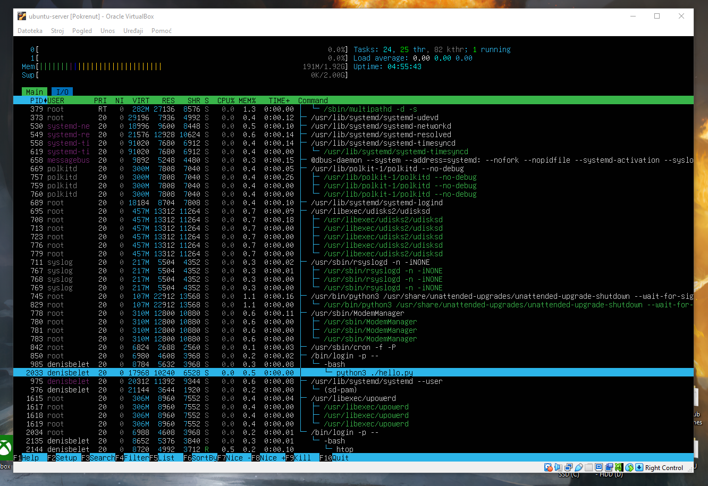

# Denis Beletić OS5

## Zadatak 1

```bash
→ sudo apt install python3
```

```bash
→ mkdir python3 && cd python3 && nano hello.py
```

**hello.py**:

```python
import time

print("Hello, World!")
time.sleep(100)
print("Goodbye, World!")
```

```bash
→ python3 ./hello.py
```

***Alt + →*** *za promijenu sesije*

*Nakon login-a:*

```bash
→ htop
```



-   PID - ID procesa
-   USER - korisnik koji je pokrenuo proces
-   PRI - prioritet (nakon izračuna *niceness-a*):
    
    -   **RT** / vrijednost *<0* znači da je **real time** proces
    -   vrijednost *20* je "**zadani prioritet**"
    -   vrijednost *<20* je **manji prioritet od zadanog**
    -   vrijednost *>20* je **veći prioritet od zadanog**
-   NI - *niceness*, određuje veći ili manji prioritet procesa, što je manji broj prioritet je veći *(min.: -20, max.: +19)* 
-   VIRT - *ukupna količina* virtualne memorije koju proces *može zauzeti* 
-   RES - količina memorije koju proces *zapravo koristi*
-   SHR - količina memorije koju proces *dijeli* s drugim procesima
-   S - stanje procesa:
    
    - S - *sleeping*  
    - R - *running*  
    - X - *dead*  
    - *itd...*
-   CPU% - *postotak CPU-a* koji proces koristi 
-   MEM% - *postotak memorije / RAM-a* koji proces koristi
-   TIME+ - *vrijeme CPU-a* potrošeno nakon pokretanja
-   Command - *naziv naredbe / putanja do naredbe* koja pokreće proces

Za prekid procesa **isključivo kroz kill naredbu**, možemo kroz 3 zastavice *(PID mojeg procesa je 2033 bio)*:

1. 
    ```bash
    → kill -9 2033  # "agresivno" zatvaranje
    ```
2.
    ```bash
    → kill -15 2033  # "ljubazno" zatvaranje

    # može i ovako:
    # kill 2033
    ```
3.
    ```bash
    → kill -2 2033  # signal za prekid koji je ekvivalentan ako pritisnemo CTRL+C u terminalu
    ```

## Zadatak 2

```bash
→ mkdir old_dir && mkdir new_dir
```

```bash
→ cd old_dir
```

```bash
→ touch readme.txt && touch scirpt.js && touch index.html
```

```bash
→ cd .. && nano skripta.sh
```

```sh
#!/bin/bash

for x in ./old_dir/*; do
    mv $x ./new_dir
    echo "Datoteka $x prebacena u new_dir."
    sleep 1
done
```

```sh
→ chmod +x skripta.sh
```

```bash
→ ./skripta.sh
```


```bash
→ nice -n 19 ./skripta.sh
```


```bash
→ sudo nice -n -19 ./skripta.sh
```


## Zadatak 3

```bash
→ sudo groupadd devteam
```

```bash
→ mkdir project
```

```bash
→ sudo useradd -G devteam lukapalfi
```

```bash
→ sudo useradd -G devteam mariosabljak
```

```bash
→ sudo chown :devteam ./project
```

```bash
→ sudo chmod 764 ./project

# Vlasnik: rwx → 4 + 2 + 1 = 7, grupa: rw- → 4 + 2 + 0, ostali: r-- → 4 + 0 + 0
# 7, 6, 4 = 764
```

*Screenshots:*


## Zadatak 4

*Definirajte oktalne reprezentacije za slj. dozvole:*

-   `rwxr-xr-x`     → **755**
    - *4 + 2 + 1*
    - *4 + 0 + 1*
    - *4 + 0 + 1*

    - **Vlasnik može čitati, pisati i izvršavati, grupa korisnika i ostali korisnici mogu čitati i izvršavati.**

-   `rw-r--r--`     → **644**
    - *4 + 2 + 0*
    - *4 + 0 + 0*
    - *4 + 0 + 0*

    - **Vlasnik može čitati i pisati, grupa i ostali mogu samo čitati.**

-   `rwx------`     → **700**
    - *4 + 2 + 1*
    - *0 + 0 + 0*
    - *0 + 0 + 0* 

    - **Vlasnik može čitati, pisati i izvršavati, grupa i ostali ne mogu ništa.**

-   `rw-rw-r--`     → **664**
    - *4 + 2 + 0*
    - *4 + 2 + 0*
    - *4 + 0 + 0*

    - **Vlasnik i grupa mogu čitati i pisati, ostali mogu samo čitati.**

-   `rwxrwxrwx`     → **777**
    - *4 + 2 + 1*
    - *4 + 2 + 1*
    - *4 + 2 + 1*

    - **Vlasnik, grupa i ostali imaju sve dozvole.**

-   `r--r--r--`     → **444**
    - *4 + 0 + 0*
    - *4 + 0 + 0*
    - *4 + 0 + 0*

    - **Vlasnik, grupa i ostali mogu samo čitati.**

-   `rw-------`     → **600**
    - *4 + 2 + 0*
    - *0 + 0 + 0*
    - *0 + 0 + 0*

    - **Vlasnik može čitati i pisati, ostali ne mogu ništa.**

## Zadatak 5.

```bash
→ nano apply.sh
```

**apply.sh**, dostaviti ću i .sh datoteku:

```sh
#!/bin/bash

if ! [[ -e $2 ]]; then
	echo "2. argument nije valjana putanja do direktorija ili datoteke."
	exit 1
fi

path=$2

if [[ $# -ne 2 ]]; then
	echo "Netocan br. argumenata. Ocekivano: 2, proslijedeno: "$#""
	exit 1
elif [[ ${#1} -ne 9 ]]; then
	echo "Netocna duzina zapis dozvola. Treba biti u oktalnome zapisu (npr. rwxrw-r--) i sadrzavati 9 znakova."
	exit 1
fi	# ${#varijabla} vraca duljinu vrijednosti unutar varijable

perm=$1

vlasnik=${perm:0:3}	# substring sintaksa, varijabla:pocetni indeks, duljina substringa koji ce se vratiti nakon indexa (ukljucuje index)
grupa=${perm:3:3}
ostali=${perm:6:3}

vlasniknum=0
grupanum=0
ostalinum=0

for (( i=0; i<3; i++ )); do
	if [[ ${vlasnik:$i:1} = "r" ]]; then
		(( vlasniknum+=4 ))

	fi

	if [[ ${grupa:$i:1} = "r" ]]; then
		(( grupanum+=4 ))
	fi

	if [[ ${ostali:$i:1} = "r" ]]; then
		(( ostalinum+=4 ))

	fi

	

	if [[ ${vlasnik:$i:1} = "w" ]]; then
		(( vlasniknum+=2 ))

	fi

	if [[ ${grupa:$i:1} = "w" ]]; then
		(( grupanum+=2 ))
	fi

	if [[ ${ostali:$i:1} = "w" ]]; then
		(( ostalinum+=2 ))
	fi

	

	if [[ ${vlasnik:$i:1} = "x" ]]; then
		(( vlasniknum+=1 ))

	fi

	if [[ ${grupa:$i:1} = "x" ]]; then
		(( grupanum+=1 ))
	fi

	if [[ ${ostali:$i:1} = "x" ]]; then
		(( ostalinum+=1 ))
	fi
done

final=$vlasniknum$grupanum$ostalinum

chmod $final $path

echo "Uspjesno primjenjena dozvola - "$perm", oktalno: "$final" na putanji: "$path"."
exit 0
```

```bash
→ chmod +x apply.sh
```

```bash
→ ./apply.sh rwxr-xr-- ./project
```

